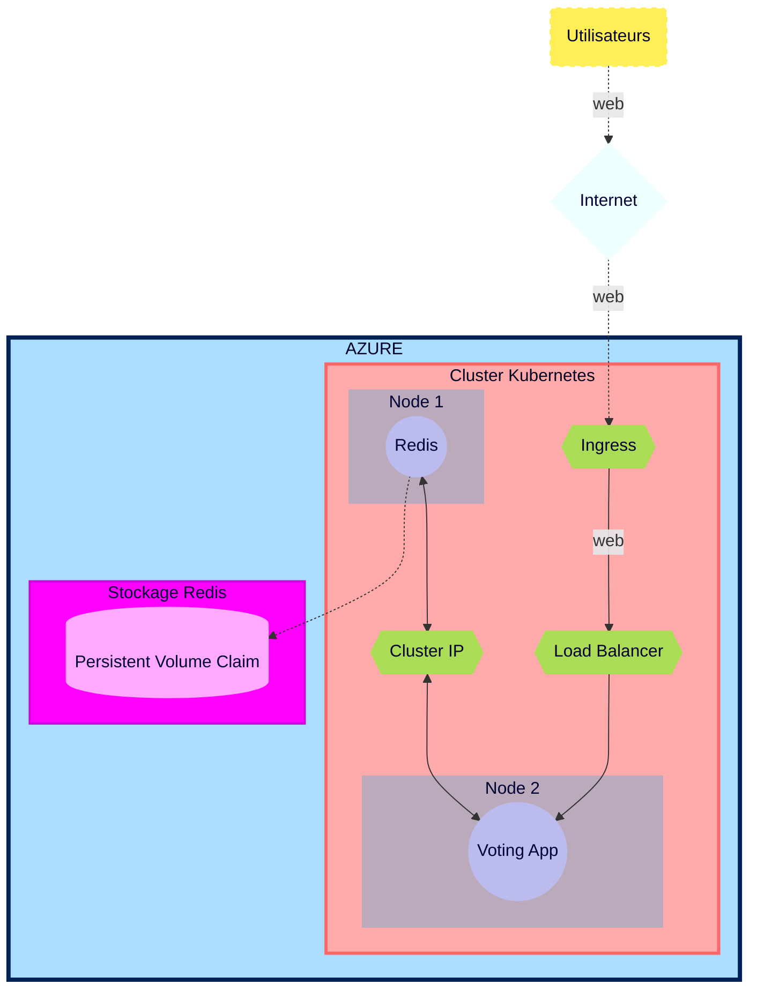

## Plan d'action

## Plan d'action Brief 6 - Part 1  

<div id='top'/>  

## Sommaire
### [0 - Scrum quotidien](#Scrum)
### [1 - Lecture des documentations Kubernetes, AKS et Github Actions](#Documentations)
### [2 - Topologie de l'infrastructure](#Topologie)
### [3 - Liste ressources](#Ressources)
### [4 - Déploiement d'un cluster AKS avec deux nodes](#ClusterAKS)
### [5 - Déploiement de Redis et de la Voting App](#RedisVotApp)
### [7 - Déploiement d’un Load Balancer](#LB)
### [8 - Application d'un ClusterIP pour Redis](#ClusterIP)
### [9 - Configuration d'un mot de passe pour le container Redis](#MDP)
### [10 - Création d'un secret Kubernetes](#Secret)
### [11 - Création d'un compte de stockage](#Stockage)
### [12 - Configuration d'un Persistent Volume et d'un P.V. Claim](#PVC)
### [13 - Création d'Ingress controller avec Kubernetes/nginx](#Ingress)
### [14 - Création d'un enregistrement DNS sur Gandi](#Gandi)
### [15 - Création d'un certificat TLS avec cert-manager pour la Voting App](#certificat)
### [16 - Auto-scaling horizontal de la Voting App](#Auto-scaling)
### [17 - Test de montée en charge](#Charge)
### [18 - Executive summary + fonctionnement de Kubernetes](#Summary)
### [19 - Document d'Architecture Technique de l'infrastructure déployée](#DAT)

[&#8679;](#top)   

<div id='Scrum'/>   

00. **Scrum quotidien**
Scrum Master = Moi (brief individuel)
Compte-rendu quotidien immédiat et désignation des premières tâches du jour.

Réunions hebdomadaires avec les autres membres de la formations afin de déterminer les difficultés, facilités et avancées de chacun.  

[scrums](https://github.com/simplon-lerouxDunvael/Brief_6/blob/main/Docs/M%C3%A9thodologie_Scrum.md)

[&#8679;](#top)  

<div id='Documentations'/>  

### **Lecture des documentations Kubernetes, AKS et Github Actions**
Lecture des documentations afin de déterminer les fonctionnements, prérequis et outils/logiciels nécessaires pour remplir les différentes tâches du Brief 7.

[&#8679;](#top)  

<div id='Topologie'/>  

### **Topologie de l'infrastructure**
Infrastructure Plannifiée

*Schéma réalisé dans le cas plus général où les pods ne sont pas dans le même node.*
*Les pods sont schématisés par un seul objet même s'ils peuvent représenter plusieurs réplicas.*



[&#8679;](#top)  

<div id='Ressources'/>  

### **Liste ressources**

-----------
| Ressources | Cluster AKS | Redis |  Voting App |
| :--------: | :--------: | :--------: | :--------: |
| Azure service | ✓ | ✓ | ✓ |
| ressource groupe | ✓ |✓ | ✓ |
| SSH (port) | N/A | 6379 | 80 |
| CPU | N/A | 100m-250m | 100m-250m |
| Mémoire | N/A | 128mi-256mi | 128mi-256mi |
| Image | N/A | redis:latest  | whujin11e/public:azure_voting_app |
| Load Balancer | N/A | ✓ puis ✗ | ✓ |
| ClusterIP | N/A | ✗ puis ✓ | ✗ |
| Kebernetes secret | ✓ | ✓ | ✓ |
| Storage secret | ✓ | ✓ | ✓ |
| Storage account (Standard LRS) | N/A | ✓ | ✓ |
| Persistent Volume | N/A | ✓ | ✗ |
| Persistent Vol. Claim (3Gi)| N/A | ✓ | ✗ |
| Ingress | ✓ | ✗ | ✓ |
| Nginx | ✓ | ✗ | ✗ |
| DNS | ✓ | N/A | ✓ |
| Cert-manager | N/A | N/A | ✓ |
| Certificat TLS | N/A | N/A | ✓ |
| Auto-scaling | ✗ | ✗ | ✓ (deployment) |

ID Subscription : 
a1f74e2d-ec58-4f9a-a112-088e3469febb

[&#8679;](#top)  

<div id='ClusterAKS'/>   

### **Déploiement d'un cluster AKS avec deux nodes**

[***Doc***](https://learn.microsoft.com/en-us/azure/aks/tutorial-kubernetes-deploy-cluster?tabs=azure-cli)

```bash
az aks create -g b6duna -n AKSClusterd --enable-managed-identity --node-count 2 --enable-addons monitoring --enable-msi-auth-for-monitoring  --generate-ssh-keys
```
##### Connexion au Cluster

```bash
az aks get-credentials --resource-group b6duna --name AKSClusterd
```

[&#8679;](#top)  

<div id='RedisVotApp'/>  

### **Déploiement de Redis et de la Voting App**

[***Doc***](https://learn.microsoft.com/en-us/azure/aks/learn/quick-kubernetes-deploy-cli#code-try-7)

A l'aide de la documentation ci-dessus, j'ai déployé les images de Redis et de la Voting App ainsi que leurs services respectifs à partir d'un même fichier .yaml.

[Redis et la VotingApp avec leurs services respectifs](https://github.com/simplon-lerouxDunvael/Brief_6/blob/main/Part_1/azure-vote-part1-final.yaml)

```bash
azure-vote-part1-final.yaml
```

[&#8679;](#top)  

<div id='LB'/>  

### **Déploiement d’un Load Balancer**

Afin de vérifier que l'application pouvait se connecter à redis, j'ai utilisé le type de service en mode Load Balancer.

[&#8679;](#top)  

<div id='ClusterIP'/>  
   
### **Application d'un ClusterIP pour Redis**

Puis, j'ai changé le type de service en mode ClusterIP afin de protéger Redis de connexions externes, tout en autorisant la connexion avec le service de la Voting App.

##### Déterminer le type de service réseau

```bash
kubectl get service voting-service --watch
```

[&#8679;](#top)  

<div id='MDP'/>  

### **Configuration d'un mot de passe pour le container Redis**

J'ai configuré le mot de passe de Redis en utilisant les secrets Kubernetes et la variable d'environnement qui y est associée. Les arguments ont également été configurés selon les conditions demandées et la variable "allow empty password" a été désactivée.

```yaml
args: ["--requirepass", "$(REDIS_PWD)"]
env:
        - name: ALLOW_EMPTY_PASSWORD
          value: "no"
        - name: REDIS_PWD
          valueFrom:
            secretKeyRef:
              name: redis-secret-duna
              key: password
```

[&#8679;](#top)  

<div id='Secret'/>  

### **Création d'un secret Kubenetes**

Afin de créer plusieurs clés dans un même secret, j'ai utilisé la commande suivante :

```bash
kubectl create secret generic [NAME_OF_SECRET] --from-literal=[KEY1]=[SECRET1] --from-literal=[KEY2]=[SECRET2]
```

```bash
kubectl create secret generic redis-secret-duna --from-literal=username=[USERNAME] --from-literal=password=[PASSWORD]
```

[&#8679;](#top)  

<div id='Stockage'/>  

### **Création d'un compte de stockage**

Pour créer un compte de stockage and le partage de fichiers (fileshare) j'ai utilisé le [Portail Azure](https://portal.azure.com/#home).

[&#8679;](#top)  

<div id='PVC'/>  

### **Configuration d'un Persistent Volume et d'un P.V. Claim**

[Nodes Multiple](https://stackoverflow.com/questions/54845025/does-kubernetes-support-persistent-volumes-shared-between-multiple-nodes-in-a-cl)

[Nodes Multiple AKS](https://learn.microsoft.com/fr-fr/azure/aks/azure-files-volume)

[Stockage AKS](https://learn.microsoft.com/en-us/azure/aks/concepts-storage)

[Pilote de stockage AKS](https://learn.microsoft.com/en-us/azure/aks/csi-storage-drivers)

[Revendication du fichier Azure AKS](https://learn.microsoft.com/en-us/azure/aks/azure-files-volume#mount-file-share-as-an-persistent-volume)

[Créer le PV](https://learn.microsoft.com/en-us/azure/aks/azure-files-volume)

Une fois le partage de fichier créé et associé au compte de stockage, j'ai créé le volume persistant (PV) que j'ai assigné à un PVC (PV claim) et ajouté à la fin du fichier .yaml (car dédié à Redis).

Pour réaliser toutes ces étapes, j'ai donné accès au compte de stockage à l'aide d'un secret Kubernetes en utilisant la commande suivante :

```bash
kubectl create secret generic storage-secret --from-literal=azurestorageaccountname=b6dredisstockacc --from-literal=azurestorageaccountkey=L7GPm1jVwpKEHiJino8OJ9CssGmTLhn6DO3W0Wq2VUo2M0R1LWsQIENZEW91TfFTM4NZJm/ZiPjX+AStbpfbEA==
```

[azure-vote-part2-final.yaml](https://github.com/simplon-lerouxDunvael/Brief_6/blob/main/Part_1/azure-vote-part1-final.yaml)

*J'ai créé un fichier .yaml nommé [delete.sh](https://github.com/simplon-lerouxDunvael/Brief_6/blob/main/Part_1/delete.sh) qui m'a permis de supprimer les ressources après les différents tests des commandes.*

[&#8679;](#top)  

<div id='Ingress'/> 

## ***Part 2***

### **Création d'Ingress controller avec Kubernetes/nginx**

Après avoir supprimé mon premier Cluster, j'en ai créé un nouveau avec quatre nodes et ses secrets Kubernetes.

```bash
az aks create -g b6duna --enable-managed-identity --node-count 4 --enable-addons monitoring --enable-msi-auth-for-monitoring  --generate-ssh-keys
```

```bash
az aks get-credentials --resource-group b6duna --name AKSClusterd2
```
Afin de bien séparer les différentes étapes et ayant rencontré des difficultés liées à la création d'Ingress controller avec Nginx (et à la documentation), j'ai créé plusieurs fichiers de configuration pour ingress.

[ingress.yaml](https://github.com/simplon-lerouxDunvael/Brief_6/blob/main/Part_2/ingress.yaml)

*Contrairement à ce que la documentation Azure préconise, Azure ACR n'est pas nécessaire pour l'Ingress controller avec Nginx.*
    
[&#8679;](#top)

<div id='Gandi'/> 

### **Création d'un enregistrement DNS sur Gandi**

Une fois l'ingress connecté, j'ai configuré ma zone DNS afin qu'elle pointe vers l'ingress via un enregistrement DNS.

[&#8679;](#top)

<div id='Certificat'/> 

### **Création d'un certificat TLS avec cert-manager pour la Voting App**

Puis, j'ai utilisé le Cert-Manager Jetstack Webhook de Gandi  pour créer un certificat TLS pour la Voting App.

[jetstack](https://github.com/bwolf/cert-manager-webhook-gandi)

```bash
helm repo add jetstack https://charts.jetstack.io
```
*Attention : à ce jour, la dernière version est la 1.9.1 (pas la 1.5.4).*

```bash
helm install cert-manager jetstack/cert-manager --namespace cert-manager --create-namespace --set installCRDs=true --version v1.9.1 --set 'extraArgs={--dns01-recursive-nameservers=8.8.8.8:53\,1.1.1.1:53}'
```

##### Configuration des identifiants Gandi dans un secret Kubernetes

J'ai ensuite créé un secret Kubernetes avec le Token API de ma zone DNS afin que le certificat TLS soit reconnu et fonctionne.

```bash
kubectl create secret generic gandi-credentials --namespace cert-manager --from-literal=api-token='[API TOKEN]'
```

##### Installation du Cert-manager webhook pour Gandi

```bash
helm install cert-manager-webhook-gandi --repo https://bwolf.github.io/cert-manager-webhook-gandi --version v0.2.0 --namespace cert-manager --set features.apiPriorityAndFairness=true  --set logLevel=6 --generate-name
```

##### Création du rôle pour le secret and assignation à Webhook

Pour que le cert-manager Webhook accède au certificat TLS, un rôle est nécessaire et doit être assigné au cert-manager.

```bash
kubectl create role access-secret --verb=get,list,watch,update,create --resource=secrets
```

kubectl create role [role-name] --verb=[Authorised-actions] --resource=[Authorised-resource]

```bash
kubectl create rolebinding --role=access-secrets default-to-secrets --serviceaccount=cert-manager:cert-manager-webhook-gandi-1665665029
```
Puis, j'ai appliqué le fichier .yaml (comme expliqué dans la documentation [jetstack](https://github.com/bwolf/cert-manager-webhook-gandi)).

[ingress.yaml](https://github.com/simplon-lerouxDunvael/Brief_6/blob/main/Part_2/ingress.yaml) -> [issuer.yaml](https://github.com/simplon-lerouxDunvael/Brief_6/blob/main/Part_2/issuer.yaml) -> [certif-space-com.yaml](https://github.com/simplon-lerouxDunvael/Brief_6/blob/main/Part_2/certif-space-com.yaml)

[&#8679;](#top)

<div id='Auto-scaling'/> 

### **Auto-scaling horizontal de la Voting App**

Les documentations suivantes ont été utilisées pour l'auto-scaling horizontal de la Voting App.

[Autoscaling](https://kubernetes.io/docs/tasks/run-application/horizontal-pod-autoscale/)

[Autoscaling Walkthrough](https://kubernetes.io/docs/tasks/run-application/horizontal-pod-autoscale-walkthrough/)

J'ai tout d'abord activé l'auto-scaler pour mon cluster.

```bash
az aks update --resource-group b6duna --name AKSClusterd2 --enable-cluster-autoscaler --min-count 1 --max-count 8
```

Puis, j'ai créé le fichier [autoscaling.yaml](https://github.com/simplon-lerouxDunvael/Brief_6/blob/main/Part_2/autoscaling.yaml) que j'ai appliqué à mon cluster.

[&#8679;](#top)

<div id='Charge'/> 

### **Test de montée en charge**

Comme demandé, j'ai ré-utilisé le script de test de montée en charge du Brief 4 que j'ai paramétré avec la nouvelle adresse de la Voting App. Cela m'a permis de vérifier en temps réèl le stress occasionné sur les serveurs. Le graphique en temps réèl apporte un rendu visuel de la montée en charge.

[graph_loadtest.py](https://github.com/simplon-lerouxDunvael/Brief_6/blob/main/Part_2/graph_loadtest.py)


*J'ai créé un fichier .yaml nommé [delete2.sh](https://github.com/simplon-lerouxDunvael/Brief_6/blob/main/Part_2/delete2.sh) qui m'a permis de supprimer les ressources après les différents tests des commandes.*

[&#8679;](#top)

<div id='Summary'/>  

### **Executive summary + fonctionnement de Kubernetes**

Cf. document "Executive_summary_Dun".

[&#8679;](#top)

<div id='DAT'/> 

### **Document d'Architecture Technique de l'infrastructure déployée**

Cf. document "DAT.md".

[&#8679;](#top)